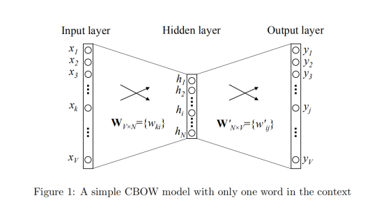
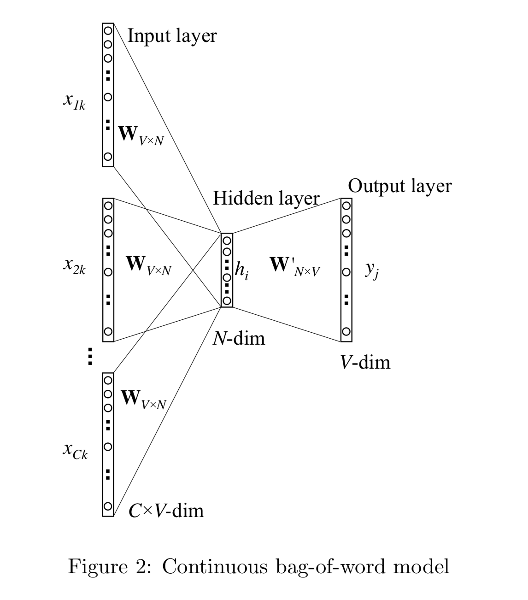

# INSIGHT_INTO_WORD2VEC
A comprehensive understanding of Word2Vec, including background, development, and formula derivation.

## Attention

* 由于文章中插入了图片以及标准数学公式，但是Github不支持用Latex编写的数学公式，建议克隆到本地之后使用[Typora](https://www.typora.io/)打开，即可查看完整版本。
* 也可以在[发布版本](https://www.zybuluo.com/Vincent-Gao/note/1447446)中查看。

## 背景：自然语言处理

自然语言处理是计算机科学领域与人工智能领域中的一个重要方向。它研究能实现人与计算机之间用自然语言进行有效通信的各种理论和方法。自然语言处理是一门融语言学、计算机科学、数学于一体的科学。因此，这一领域的研究将涉及自然语言，即人们日常使用的语言，所以它与语言学的研究有着密切的联系，但又有重要的区别。自然语言处理并不是一般地研究自然语言，而在于研制能有效地实现自然语言通信的计算机系统，特别是其中的软件系统。因而它是计算机科学的一部分。

自然语言处理的最最基础的部分就是要让计算机能够识别人类的语言，因此词向量也就应运而生了。词向量顾名思义就是以向量的形式表示词。
## 几种常见的模型（由简单到复杂）
### 词袋模型
词袋模型的基本思想就是将文档中出现的所有词用一个袋子装起来。词袋模型不考虑词出现的先后顺序，并且认为文本中每个词出现的概率都是独立的，不依靠其他词的出现。

词袋模型可以看成是用向量来表示句子。即

|   | 词1 | 词2 | …… | 词n|
|------ | ------ | ------ | ------ | ------|
|句子1 |   |  |  |  |
|句子2 |   |  |  |  |
|……|   |  |  |  |
|句子m |   |  |  |  |

纵坐标为选定的特征词（可以是文档中所有出现的词，也可以是选定的某一些词）。可以认为最初的空格里面全是0，当句子中出现了某个词就在相应的位置做加一的操作，最后得到的数字的组合就是相应的句子的向量。
### one-hot编码
one-hot编码是词向量模型的一种体现。这种编码是将文档中出现的所有的词用一个1和N-1个0表示，N是文档中出现的单词的个数。

|     | 维度1 | 维度2 | …… | 维度n|
|---- | ---- | ---- | ---- | ----|
|词1  | 1 | 0 | 0 | 0 |
|词2  | 0 | 1 | 0 | 0 |
|……   |   |  |  |  |
|词n  | 0 | 0 | 0 | 1 |

one-hot编码的好处是可以很好地表示离散数据，每一个词都可以用向量的形式表示出来。且一定程度上起到了升维的作用。在回归，分类，聚类等机器学习的算法中，特征之间距离的计算或者相似度的计算是非常重要的，而我们常用的距离或者相似度的计算都是在欧式空间的相似度计算。使用one-hot编码将离散特征的取值数字化表示到了欧式空间，离散特征的某个取值就对应与欧式空间的某个点。将离散型特征使用one-hot编码，有时确实会让特征之间的距离计算更加合理。

而坏处也比较明显，one-hot是词袋模型的体现，因此有着词袋模型的固有缺点（即忽略掉了词出现的顺序和词的上下文之间的联系）。并且one-hot编码会产生一个较大的稀疏矩阵，在用one-hot编码得到的向量计算时，如果词的维度很大可能造成维灾难而无法计算。
### N-Gram模型

N-Gram模型算是对上面词袋模型的补充吧。词袋模型认为文本中每个词出现的概率都是独立的，而这与我们的常规认知是不相符合的（不然完形填空该怎么做啊），而N-Gram模型则认为可以通过计算概率的方法来获得上下文之间的关系，并且参考的上下文的词越多，预测的越准确。

词袋模型的基本思想是用概率来表示上下文之间的关系

一个经典的例子：假设我们有一个由n个词组成的句子
$$
\mathrm { s } = \left( w _ { 1 } , w _ { 2 } , w _ { 3 } , \ldots \ldots w _ { \mathrm { n } } \right)
$$
如何衡量它的概率呢？让我们假设，每一个单词$w_i$都要依赖于从第一个单词$w_i$到它之前一个单词$w_{i-1}$的影响:
$$
\begin{array} { c } 
\begin{array} { c } { p ( s ) = p \left( w _ { 1 } , w _ { 2 } , w _ { 3 } , \ldots , w _ { n } \right) = p \left( w _ { 1 } \right) \cdot p \left( w _ { 2 } | w _ { 1 } \right) \cdot p \left( w _ { 3 } | w _ { 2 } , w _ { 1 } \right) \cdot \ldots } \\ { \cdot p \left( w _ { n } | w _ { n - 1 } , w _ { n - 2 } , \ldots , w _ { 1 } \right) } \end{array}
\end{array}
$$

这样求一个句子出现的概率就变成了求若干个条件概率。但这样又会出现参数过多的问题。因此我们引入马尔科夫假设，即一个词出现的概率只与它之前若干个出现的单词有关。

假设一个词出现的概率只与它前面$n$个词出现的概率相关，**N-Gram**也就由此而来了。通常情况下$n$越大，得到的概率越准确但同时计算量也越大，因此$n$一般取2或者3。
	
词的条件概率用极大似然估计来计算（说白了就是数频数）。在此就不过多赘述了。

### One-Word模型

**One-Word**是用神经网络来实现**N-Gram**（$n=2​$时）。即**N-Gram**是思想，而**One-Word**模型是实现方法。即一个用**one-hot**编码的词作为输入，通过第一个权重矩阵得到隐藏层，再通过第二个权重矩阵的到输出层的前身，该前身再做**Softmax**得到输出端的向量表示。

设：词汇量的大小为$V$，隐藏层的大小为$N$。输入向量是一个**one-hot**编码的向量，**one-hot**编码的向量表示为$(x_1,x_2,…,x_v)$，其中只有一个$x_k$为1，其余的均为0。姑且认为$X(V \times 1), h(N \times 1), Y(V \times 1)$都是列向量

输入层和隐藏层之间是一个$V \times N$的矩阵$W_{V \times N}$

$$
\left( \begin{array}{cccc}{\mathrm{W}_{11}} & {\mathrm{W}_{12}} & {\dots} & {\mathrm{W}_{1 n}} \\ {\mathrm{W}_{21}} & {\mathrm{W}_{22}} & {\dots} & {\mathrm{W}_{2 n}} \\ {\cdots} & {\cdots} & {\cdots} & {\cdots} \\ {\mathrm{W}_{\mathrm{vl}}} & {\mathrm{W}_{\mathrm{v} 2}} & {\dots} & {\mathrm{W}_{\mathrm{vn}}}\end{array}\right)
$$

$$
h=x^T W
$$

则$h$为$\left( \begin{array}{llll}{\mathrm{W}_{\mathrm{kl}}} & {\mathrm{W}_{\mathrm{k} 2}} & {\dots} & {\mathrm{W}_{\mathrm{kn}}}\end{array}\right)^{\mathrm{T}}$，即$W$矩阵的第$k$行的转置 （因为$x_k$为1，其余的均为0）

隐藏层到输出层是一个$N \times V$的权重矩阵

形式和上面那个矩阵类似，只是矩阵的元素用$\mathrm{w}_{\mathrm{ij}}^{\prime}$表示

$$
\mathrm{U}_{\mathrm{j}}=\mathrm{W}_{\mathrm{j}}^{\prime} \mathrm{h}
$$

注：$\mathrm{W}_{j}^{'}$为$W$矩阵的第$j$行，$U_j$为输出层的第$j$个位置的前身

$U_j$经过一个**Softmax回归**得到$y_j$，$y_j$为正经的输出层的第$j$个位置

$$
\mathrm{P}\left(\mathrm{w}_{j} | \mathrm{w}_{I}\right)=y_{j}=\frac{e^{j}}{\sum_{i=1}^{V} e^{i}}
$$

即在输入已经确定的情况下，输出的值为$w_j$的概率为这个

更新$W$和$W^{'}$矩阵

首先定义一个损失函数（我们希望这个损失函数最小）（至于为什么这么定义还是没太理解）

$$
\mathrm{E}=-\mathrm{P}\left(\mathrm{w}_{\mathrm{o}} | \mathrm{w}_{\mathrm{i}}\right)=\mathrm{U}_{\mathrm{j}^{*}}-\log \left(\sum_{i=1}^{V} e^{i}\right)
$$

首先更新$W^{'}$矩阵：

这就需要用$E$来对$\mathrm{w}^{'}_{\mathrm{ij}}$来求偏导，以获得最快更新$W^{'}$的方向（即梯度方向）

在求偏导之前需要知道这样的前提 即

$$
\frac{\partial \mathrm{E}}{\partial \mathrm{U}_{i}}=\mathrm{y}_{\mathrm{i}}-\mathrm{t}_{\mathrm{i}}
$$

当预测准确的时候$t_i$为1，否则为0，这个计算公式可以看成是输出层的的预测误差，至于结果为什么是这样的暂时还不是很清楚

在上述前提下

$$
\frac{\partial \mathrm{E}}{\partial \mathrm{W}_{\mathrm{ij}}}=\frac{\partial \mathrm{E}}{\partial \mathrm{U}_{\mathrm{i}}} * \frac{\partial \mathrm{U}_{\mathrm{i}}}{\partial \mathrm{w}_{\mathrm{ij}}}=\left(y_{i}-t_{i}\right) * h_{i}
$$

则权重更新方程为

$$
\mathbf{W}_{i j}^{\prime}=\mathbf{W}_{i j}^{\prime}-\eta\left(y_{i}-t_{i}\right) * h_{i}
$$

其次更新$W$矩阵
和上文差不多，也是需要$W$对$\mathrm{W}_{\mathrm{ij}}$求偏导

求之前也需要知道一个前提：

$$
\frac{\partial \mathrm{E}}{\partial h_{i}}=\sum_{i=1}^{V} \frac{\partial \mathrm{E}}{\partial U_{i}} \frac{\partial U_{i}}{\partial h_{i}}=\sum_{i=1}^{V}\left(y_{i}-t_{i}\right) * w_{i j}^{\prime}
$$

此式子的结果用$\mathrm{EH}_{\mathrm{i}}$代为表示：

$$
\mathrm{EH}=\left(\mathrm{EH}_{1} \cdot \mathrm{EH}_{2}, \ldots . . \mathrm{EH}_{\mathrm{N}}\right)
$$

在此前提下求$E$对$\mathrm{W}_{i j}$的偏导数为：
$$
\frac{\partial \mathrm{E}}{\partial \mathrm{w}_{i j}}=\frac{\partial \mathrm{E}}{\partial \mathrm{h}_{j}} \frac{\partial \mathrm{h}_{j}}{\partial \mathrm{w}_{i j}}=E H_{j} * X_{i}
$$

由于X非1即0，所以权重更新公式为：

$$
\mathrm{V}_{w i}=\mathrm{V}_{w i}-\eta E H
$$
其中$\mathbf{V}_{w i}$为one-hot编码中非零行所对应的矩阵的行，其他行不用关心。

### Google的Word2Vec的算法
#### CBOW模型（连续词袋模型）

* **基本概念**

cbow的基本思想是用中心词的上下文的c个词来预测中心词。

连续词袋模型模型相当于是**One-Word**模型的补充，**One-Word**是一个输入，一个输出，**CBOW**是c个输入，1个输出。

$\mathbf{X}_{1 k}$到$\mathbf{X}_{c k}$ 是上下文从第一个到第C个单词的one-hot编码，这C个one-hot编码通过相应位置加和求平均的方法得到一个$1 \times V$的向量，该向量再乘以我们期望得到的第一个矩阵$\mathrm{W}_{\mathrm{V} \times \mathrm{N}}$来得到隐藏层的向量$h_i$（一个$1 \times N$的向量），即

$$
\mathrm{h}=\frac{1}{C} W\left(\sum_{i=1}^{C} x_{i}\right)
$$

上图的$h_i$表示的意思可以与上上图的$h_i$相比较。然后$h$乘以另一个我们期望得到的矩阵$\mathrm{W}_{\mathrm{N}^{'} \mathrm{V}}^{*}$，得到一个$1 \times V$的向量U，再用Softmax得到一个$1 \times V$的向量$Y$，其中$Y_i$最大的那个值就是期待的中心词。通过不断地学习来调整$W$和$W^{'}$的值。

* **CBOW矩阵的调整**

建立一个损失函数：

$$
\mathrm{E}=-\log \left(\mathrm{P}\left(\mathrm{w}_{\mathrm{o}} | \mathrm{W}_{\mathrm{I}, 1} \ldots \mathrm{W}_{\mathrm{I}, \mathrm{c}}\right)\right)\\
=-U_{j^{*}}+\log \left(\sum_{j}^{V} e^{u_{i}}\right)\\
=-\mathrm{V}_{\mathrm{w}_{\mathrm{o}}}^{\prime T} \cdot h+\log \left(\sum_{i=1}^{V} e^{v_{v_{i}} T} \cdot h\right)
$$

然后和上面one-word模型更新两个矩阵的方法类似  都是对相应的矩阵的元素求导得到梯度来更新矩阵。

$$
\mathrm{V}_{\mathrm{wj}}^{\prime}=\mathrm{V}_{\mathrm{wj}}^{\prime}-\eta\left(\mathrm{y}_{\mathrm{i}}-\mathrm{t}_{\mathrm{i}}\right) \mathrm{h}
$$

用上述公式来更新$W^{'}$，其中$j=1,2, \dots \dots ,\mathrm{V}$

其中$\mathrm{V}^{\prime}_{\mathrm{w} j}$为隐藏层到输出等的矩阵的第$j$列

$$
\mathrm{V}_{\mathrm{w}, \mathrm{I}, \mathrm{c}}=\mathrm{V}_{\mathrm{w}, \mathrm{I}, \mathrm{c}}-\frac{1}{\mathrm{C}} \eta \cdot \mathrm{EH}
$$

用上述公式来更新$W$

其中$\mathrm{V}_{\mathrm{w}, \mathrm{I}, \mathrm{c}}$是输入上下文单词的第c个单词的输入向量。其中$c=1,2, \cdots \cdots ,\mathrm{C}$。

#### skip-gram模型

* **模型概述**

Skip-Gram模型可以看成是与CBOW模型相反的，即用一个中心词来推测其附近的c个上下文（注：得到的c个上下文不考虑与中心词之间的距离的影响）。

* **数学推导**

隐藏层$h$仍然是矩阵$W$的第$k$行（$X_k=1$的情况下）

与之前稍微有点不同的是Skip-Gram模型的输出有多个，每个输出都使用的相同的$W^{'}$来计算

$$
\mathrm{P}\left(\mathrm{w}_{c, j}=w_{o, c} | w_{I}\right)=y_{c, j}=\frac{e^{u_{c, j}}}{\sum_{i=1}^{V} e^{u_{i}}}
$$

其中$\mathrm{W}_{c, j}$是输出层第$c$个输出的第$j$个单词，而$w_{o, f}$是第c个输出的实际输出的单词，$\mathrm{U}_{c, j}$是h与$W^{'}$的第$j$行向量相乘的结果，由于乘的都是同一个第$j$行，所以：

$$
\mathrm{U}_{\mathrm{c}, \mathrm{j}}=\mathrm{U}_{\mathrm{j}}=V_{w_{j}}^{\prime T} h
$$

再次构造损失函数：

$$
\mathrm{E}=-\log \left(\mathrm{P}\left(w_{0,1}, w_{0,2}, \ldots w_{0, \mathrm{C}} | w_{\mathrm{I}}\right)\right) \\
=-\sum_{i=1}^{C} U_{j_{i}^{*}}+\operatorname{Clog}\left(\sum_{i=1}^{V} U_{i^{\prime}}\right) \\
$$

$$
\frac{\partial \mathrm{E}}{\partial \mathrm{U}_{c, j}}=y_{c, j}-t_{c, j}
$$

用$\mathrm{EI}=\left\{\mathrm{EI}_{1}, \mathrm{EI}_{2}, \ldots . \mathrm{EI}_{\mathrm{v}}\right\}$来表示所有上下文单词的预测误差之和，即：

$$
\mathrm{EI}_{\mathrm{j}}=\sum_{\mathrm{i}=1}^{\mathrm{C}} \mathrm{y}_{\mathrm{i}, \mathrm{j}}-\mathrm{t}_{\mathrm{i}, \mathrm{j}}
$$

$\mathrm{W}^{\prime}$的权重矩阵更新公式为：

$$
w_{i, j}^{\prime}=w_{i, j}^{\prime}-\eta^{*} E I_{j}^{*} h_{i}
$$

W的权重矩阵更新公式为：

$$
\mathrm{V}_{\mathrm{w}_{1}}=\mathrm{V}_{\mathrm{w}_{1}}-\eta \mathrm{EH}
$$

其中

$$
\mathrm{EH}=\sum_{j=1}^{V} E I_{j} * w_{i, j}^{\prime}
$$

#### 参考来源：

[算法原理以及公式推导](https://blog.csdn.net/qq_41664845/article/details/82971728)

[理解Word2Vec之Skip-Gram模型](https://zhuanlan.zhihu.com/p/27234078?utm_source=qq&utm_medium=social&utm_oi=989578670297628672)
